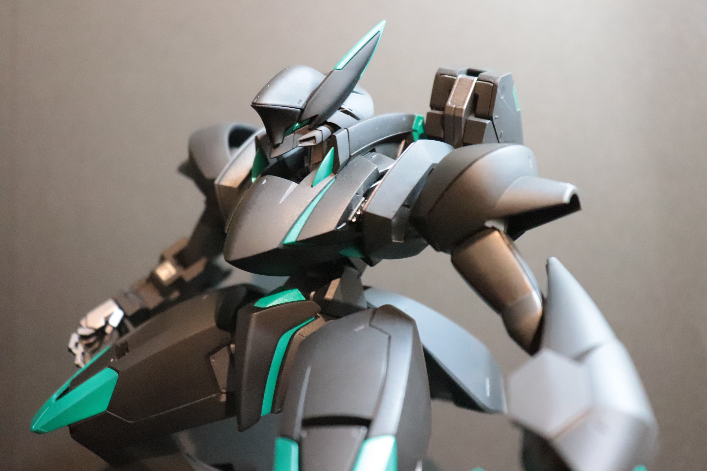
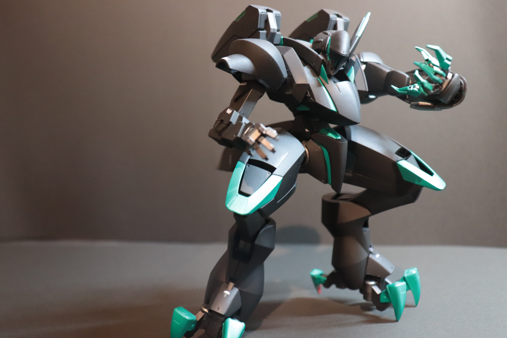

# アメインゴースト

[一覧に戻る](https://san-you.github.io/Prammary)

完成日: 2022/04/15

## 外観

## 学べた点 / 良かった点
- エアブラシの使い方

## 失敗点
- エアブラシで吹く塗料を艶消しの塗料を吹いてしまって墨入れが失敗した…
  - 墨を入れてしまうと滲んでしまってかなり残念な感じになってしまったので、結局ほぼ墨を入れずにやった
  - めんどかったので既存のモールドを掘り直してなかったのも原因かも
  - 次はちゃんと掘り直します
- 合わせ目けしやってない
  - 単純に素組がカッコよすぎて気付いてなかった。
    - 足にがっつり入ってる…
  - 練習のためにも次からちゃんと見ます

## 雑感
二体目のプラモ。

今回からエアブラシを導入してみて、初めて全塗装をした機体。
エナメル塗料をエアブラシで吹いたり、エアブラシ関連のトラブルとかがかなり多かったので、色々学べた。

特に艶消し塗料で塗装してしまったのがかなり致命的で、正直萎えた。
ペイントリムーバーを使ってみようとも思ったが、めんどくさかったのでやらなかったが、完成形はかなり満足したので良し。

デカールとかスミ入れでゴテゴテしすぎているのが好みじゃないので、割とシンプルにするように意識したが、もうちょいデカール貼っても良かったかも。

ただ、紺×赤から黒×メタリックグリーンのカラーリングに変更したことでかなりスタイリッシュな雰囲気になったので、塗装色の変更はこれからもやってみる。

[一覧に戻る](https://san-you.github.io/Prammary)