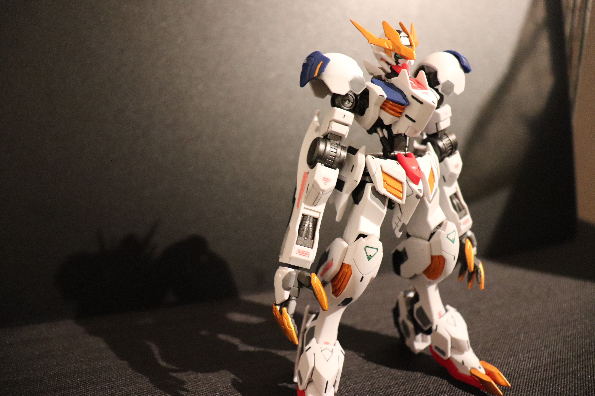
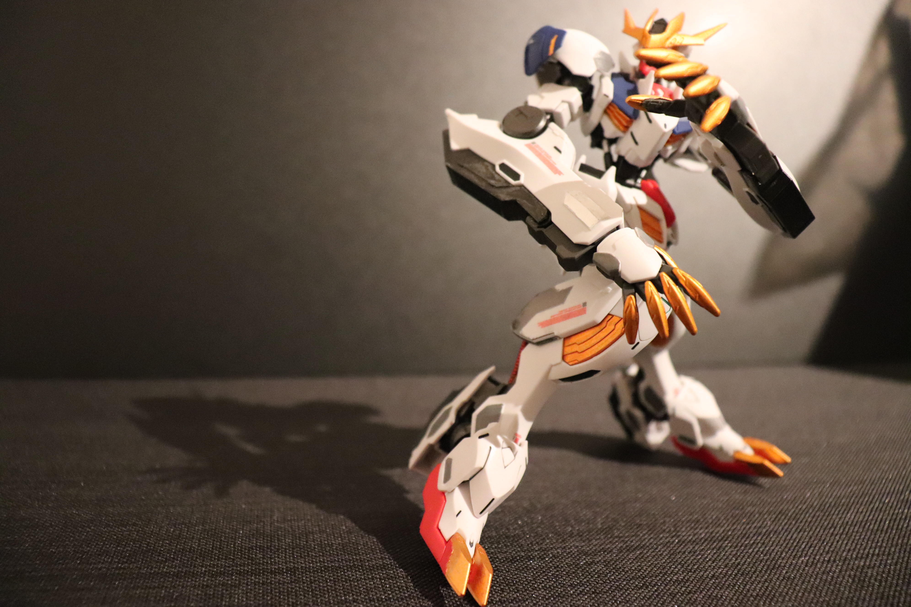

[一覧に戻る](https://san-you.github.io/Prammary)

完成日: 2022/02/19

## 外観

## 学べた点 / 良かった点
- プラモの作成工程
  - 最初のプラモなので良かった
- 部分塗装もなかなかいい感じだった

## 失敗点
- 初めてなので全ての工程で時間がかかった
- 合わせ目けしに失敗した
  - 最初からメイスで試して大失敗したので結局武器がない状態になってしまった…

## 雑感
初めて作成したプラモ。シンプルに楽しかった。

ニッパーの使い方から学んでいったので、かなり時間がかかってしまったが、その分新しいことを学べて、新鮮だった。
部分塗装やデカールなど、できる範囲でできるだけクオリティを上げられるように試して、個人的には満足。

あとから見るとだいぶ拙い出来だが、まあいいでしょう！

[一覧に戻る](https://san-you.github.io/Prammary)